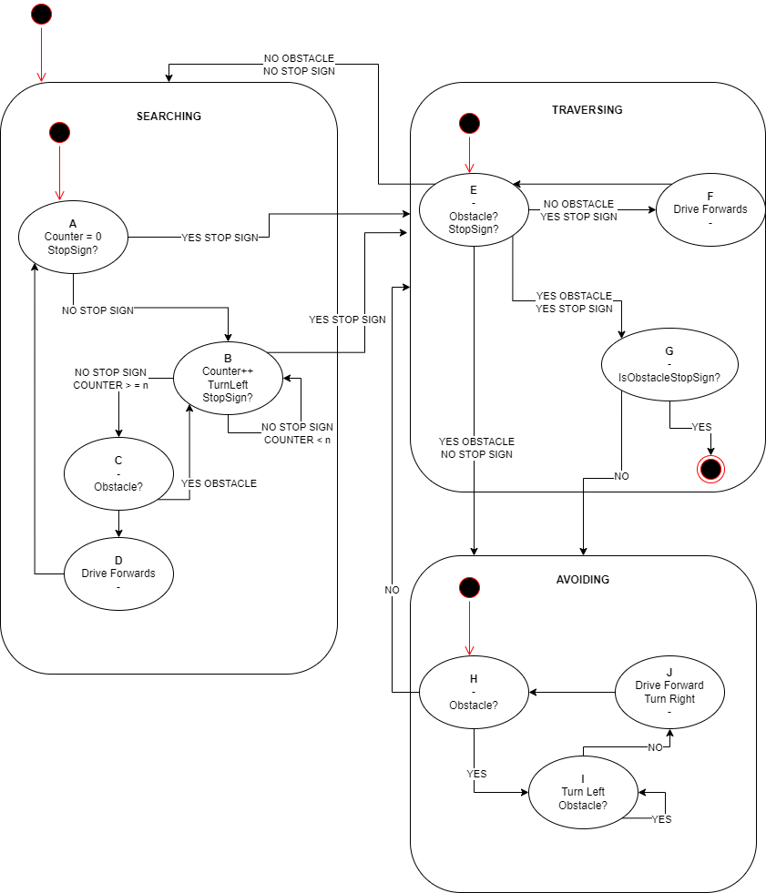

# High-Definition Virtual Reality (VR) Platform for Remote Monitoring and Collaboration
This repository contains code related to a project aimed at developing a customizable VR platform for remote monitoring 
and collaboration in various fields such as industrial, medical, public safety, and entertainment. The project will 
focus on developing a basic VR system that can provide a virtual tour of the 5G Ericsson ARISE wireless lab at Carleton 
University and support remote collaboration between users.

## Background
Recent advances in VR technologies have led to the availability of off-the-shelf VR products for consumers. However, 
these products are mainly geared towards gaming and pre-made media consumption and lack customization for industrial 
use. The aim of this project is to develop an end-to-end VR solution that can be customized for remote monitoring and 
collaboration.

## Purpose
The purpose of this project is to provide the 5G Ericsson ARISE wireless lab with a state-of-the-art collaboration tool 
that can be rolled out to other facilities. The project will involve studying, evaluating, and recommending the best 
components for an end-to-end VR solution and developing the necessary software to interface them seamlessly with the 
user(s).

## Built With

Python - The language used for Audio-Video, Control Transmission, and ROS Nodes

C++ - The language used for Arduino and ROS nodes

OpenCV - The Computer Vision Library used

stereovision - The Stereo Camera Library used

OpenVR - The VR library used

PyAV - The Python library used

vidstream - The Python library used

inputs - The Python library used

## Scope and Deliverables
The project will be carried out in two phases. The first phase will involve the development of a high-definition 
360-degree VR camera and VR goggle system. The second phase will involve the development of a user-controlled 360-degree 
roaming high-definition VR camera solution with obstacle avoidance and strict route implementation.

### Phase 1
- [x] Conduct a literature survey on capabilities and requirements of various VR goggles and 360-degree cameras.
- [x] Select, purchase, and evaluate the most promising VR goggles and 360-degree cameras with respect to usability, performance specs, and reliability reviews.
- [x] Establish an end-to-end high-definition VR link between the camera and VR hardware.
- [x] Use the VR goggle head tracking to sweep the video feed from the camera.
- [x] Create a custom application to establish a secure remote VR video session.
- [x] Investigate the feasibility to integrate the solution with MS Teams and other conferencing software.
- [x] Investigate the system capacity and guarantee a smooth video feed with minimal latency and delay variation.
- [x] Find operational regimes to stress the system and assess its performance limits.

### Phase 2
- [x] Develop a small remotely controlled and semi-autonomous vehicle to transport the 360-degree camera in a remote location or lab.
- [x] [UNDER DEVELOPMENT] Develop obstacle avoidance and strict route implementation with either floor markings or image processing techniques.
- [x] Integrate standard controllers/feedback devices that accompany the VR goggles to control the VR camera transport contraption around the remote location/lab with minimal latency.
- [x] Build on the infrastructure developed in Phase 1 to make the VR camera mobile that allows a user to remotely navigate the camera around the lab over a wireless connection and the internet.
- [x] Create a custom application to establish a secure remote VR video session and also allow the integration of VR controllers to navigate the camera in the remote location/lab.

## Directory Structure
```
|   .gitignore
|   Pipfile
|   README.md
|   requirements.txt
|
+---AudioVideoTransmission
|   |   AudioTransmissionVisualReciever.py
|   |   AudioVisualTransmission.py
|   |
|   \---reference
|           AudioTransmission.py
|           InternetPhone.py
|
+---ControllerTransmission
|   |   HeadTrackingDebug.py
|   |   HeadTrackingTransmission.py
|   |   InputTransmission.py
|   |   InputTransmissionReceiveTest.py
|   |
|   +---controller_objects
|   |   |   GamepadController.py
|   |   |   KeyboardController.py
|   |   |   ReverbG2.py
|   |
|   \---reference
|           ReverbG2.py
|           ReverbG2_1.py
|
+---ObjectAvoidance
|   +---filters
|   |   +---point_cloud
|   |   |   |   3dmap_set.txt
|   |   |   |   calibration.mp4
|   |   |   |   Calibration.py
|   |   |   |   fine_tune_1.jpg
|   |   |   |   fine_tuning.py
|   |   |   |   ObstacleAvoidance.py
|   |   |   |   PointCloudVisualization.py
|   |   |   |   stop_sign.xml
|   |   |   |
|   |   |   \---calib_result
|   |   |           cam_mats_left.npy
|   |   |           cam_mats_right.npy
|   |   |           disp_to_depth_mat.npy
|   |   |           dist_coefs_left.npy
|   |   |           dist_coefs_right.npy
|   |   |           e_mat.npy
|   |   |           f_mat.npy
|   |   |           proj_mats_left.npy
|   |   |           proj_mats_right.npy
|   |   |           rectification_map_left.npy
|   |   |           rectification_map_right.npy
|   |   |           rect_trans_left.npy
|   |   |           rect_trans_right.npy
|   |   |           rot_mat.npy
|   |   |           trans_vec.npy
|   |   |           undistortion_map_left.npy
|   |   |           undistortion_map_right.npy
|   |   |           valid_boxes_left.npy
|   |   |           valid_boxes_right.npy
|   |   |
|   |   +---reference
|   |   |   |   access_test.py
|   |   |   |   ApplyEdgeDetection.py
|   |   |   |   calibration.mp4
|   |   |   |   calibration_1.jpg
|   |   |   |   calibration_10.jpg
|   |   |   |   calibration_12.jpg
|   |   |   |   calibration_2.jpg
|   |   |   |   calibration_3.jpg
|   |   |   |   calibration_4.jpg
|   |   |   |   calibration_5.jpg
|   |   |   |   calibration_6.jpg
|   |   |   |   calibration_7.jpg
|   |   |   |   calibration_8.jpg
|   |   |   |   calibration_9.jpg
|   |   |   |   calibration_via_video.py
|   |   |   |   EdgeDetection.py
|   |   |   |   img0.jpg
|   |   |   |   output.mp4
|   |   |   |   stereopi.mp4
|   |   |   |   stereo_calibration.py
|   |   |   |   StopSignDetect.py
|   |   |   |   stop_sign.xml
|   |   |   |   video.mp4
|   |   |   |
|   |   |   \---calib_result
|   |   |           cam_mats_left.npy
|   |   |           cam_mats_right.npy
|   |   |           disp_to_depth_mat.npy
|   |   |           dist_coefs_left.npy
|   |   |           dist_coefs_right.npy
|   |   |           e_mat.npy
|   |   |           f_mat.npy
|   |   |           proj_mats_left.npy
|   |   |           proj_mats_right.npy
|   |   |           rectification_map_left.npy
|   |   |           rectification_map_right.npy
|   |   |           rect_trans_left.npy
|   |   |           rect_trans_right.npy
|   |   |           rot_mat.npy
|   |   |           trans_vec.npy
|   |   |           undistortion_map_left.npy
|   |   |           undistortion_map_right.npy
|   |   |           valid_boxes_left.npy
|   |   |           valid_boxes_right.npy
|   \---res
|           object_avoidance_algorithm.drawio
|           object_avoidance_algorithm.png
|
+---ROSModelNodes
|   +---arduino
|   |       ttyACM0_ard.ino
|   |       ttyACM1_ard.ino
|   |       ttyACM2_ard_servo.ino
|   |
|   +---reference
|   |       arduino.cpp
|   |       ard_intf.cpp
|   |       audio_pass.py
|   |       udp_intf.py
|   |
|   \---ros
|           api.launch
|           ard_intf.cpp
|           udp_intf.py
|           udp_intf_2.py
|
\---scratch
        fusion_gear.py
        yolov4-tiny.cfg
        yolov4-tiny.weights

```

## Feature Breakdown

### Audio-Video Transmission

```
+---AudioVideoTransmission
|   |   AudioTransmissionVisualReciever.py
|   |   AudioVisualTransmission.py
```

#### Description

The goal of this feature is to provide real time interactions between the driver of the remote monitoring vehicle and 
those in the monitored area. This feature provides a video stream of the driver to the screen located on the front of 
the robot.  As well, this makes use of two-way internet enabled audio capturing and output to allow for conversations 
between the driver and the environment.

#### Usage

To properly launch this feature, one must run the following command on the remote monitoring device (SBC) from the 
project root directory:

```
python3 AudioVideoTransmission/AudioTransmissionVisualReciever.py
```

On the remote monitoring transmission device (VR Transmitter), at the same time as the above command is run, one must 
run the following command on the remote monitoring device (SBC) from the project root directory:

```
python3 AudioVideoTransmission/AudioVisualTransmission.py
```

### Controller Transmission

```
+---ControllerTransmission
|   |   HeadTrackingDebug.py
|   |   HeadTrackingTransmission.py
|   |   InputTransmission.py
|   |   InputTransmissionReceiveTest.py
|   |
|   +---controller_objects
|   |   |   GamepadController.py
|   |   |   KeyboardController.py
|   |   |   ReverbG2.py
```

#### Description

The goal of this feature is to provide real-time control transmission. This code works to capture different input types, 
to parse these inputs into desired commands, and then transmit these controls to the robot. This all is meant to occur 
in a low latency manner, providing a way to move remotely in near real-time.

#### Usage

To make use of GamePad remote control of the robotics system, one must connect their GamePAd controller and launch `STEAM` in big picture mode (and then 
minimize the tab).  Following this, run the following command from the project root directory:

```
python3 ControllerTransmission/InputTransmission.py
```

To make use of the remote head tracking control on the robot, one must first launch Windows Mixed Reality and connect an
HP Reverb G@ to their system.  Following this, run the following command from the project root directory:

```
python3 ControllerTransmission/HeadTrackingTransmission.py
```

### Object Avoidance

```
+---ObjectAvoidance
|   +---filters
|   |   +---point_cloud
|   |   |   |   3dmap_set.txt
|   |   |   |   calibration.mp4
|   |   |   |   Calibration.py
|   |   |   |   fine_tune_1.jpg
|   |   |   |   fine_tuning.py
|   |   |   |   ObstacleAvoidance.py
|   |   |   |   PointCloudVisualization.py
|   |   |   |   stop_sign.xml
```

#### Description

The goal of these features is two pronged.  Firstly, the goal is to parse in real-time the perceptions of the robot, 
through the manner of an on-board stereo camera.  The perceptions include stop sign detection, depth detection, object 
identification, and edge detection. The secondary goal is to leverage these perceptions to avoid obstacles as part of a 
path finding implementation.

#### Usage

To calibrate the system with the depth mapping, attach the stereo-camera to an internet connection, and run the 
following command:

```
python3 ObjectAvoidance/filters/point_cloud/Calibration.py
```

Note, to properly calibrate the system, one must hold a checkerboard in front of the camera and hold it at different 
angles and depths from the camera while this script is running.  One can find such a checkerboard at the following link:
https://markhedleyjones.com/projects/calibration-checkerboard-collection

Following the calibration, one can fine tune the calibration by running the following command:

```
python3 ObjectAvoidance/filters/point_cloud/fine_tuning.py
```

The design for how the system should act in an obstacle avoidance scenario can be seen in the following diagram:

</img>

To run real time depth mapping, with built in stop sign detection, run the following command:

```
python3 ObjectAvoidance/filters/point_cloud/PointCloudVisualization.py
```

The implementation of this system is demonstrated in the following python file:

```
ObstacleAvoidance.py
```

### ROS Model Nodes

```
+---ROSModelNodes
|   +---arduino
|   |       ttyACM0_ard.ino
|   |       ttyACM1_ard.ino
|   |       ttyACM2_ard_servo.ino
|   |
|   \---ros
|           api.launch
|           ard_intf.cpp
|           udp_intf.py
|           udp_intf_2.py
```

#### Description

#### Usage

## Authors
Nicholas Sendyk - [NicholasSend](https://github.com/NicholasSend)

Brian McDonald - [bmac1613](https://github.com/bmac1613)

## Acknowledgments
![alt text][logo_1] ![alt text][logo_2]

[logo_1]: https://carleton.ca/brand/wp-content/uploads/brand-logo-800w-1.jpg "Carleton University"

[logo_2]: https://www.ericsson.com/cdn-cgi/image/format=auto,fit=scale-down,width=700/4aa9bc/assets/global/qbank/2020/11/02/econ-logo_1500-92386511d4f7159bb1454d52ed2aa73819e7d.jpg "Ericsson Canada"

Thank you to Ericsson and Carleton University for the support on this research.

Thank you to Arsh Salym and Nikita Volochay for your support on the hardware side of the project.
As well, a special thanks to the supervisors of the project Dr. Ioannis Lambadaris and Dr. Syed Naqvi.
